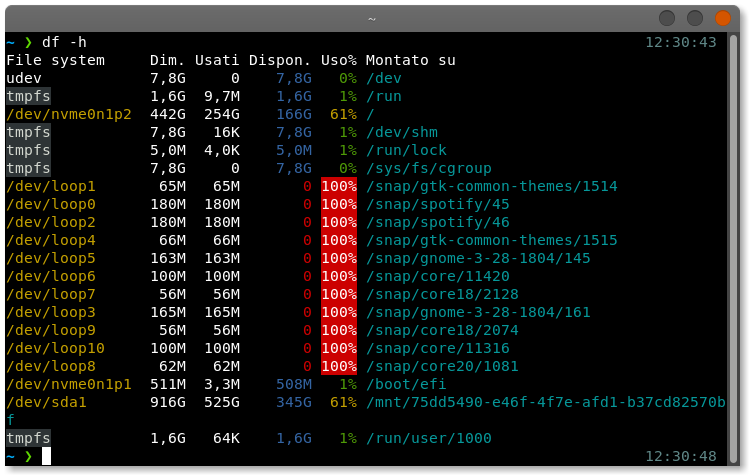
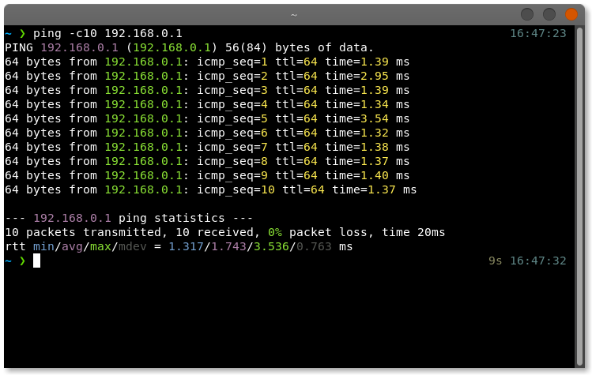
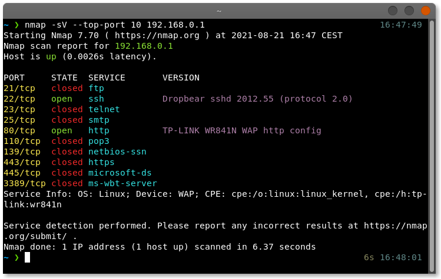

# Colorer

**Colorer** is a simple text parsing command line utility that provides color to commands that do not have it by default. Tested on Linux and MacOS.

## Commands

By using colorer it is possible to add color to the following commands:
- `df`
- `dig`
- `docker` (still WIP)
- `env`
- `free`
- `last` and `lastb`
- `ls`
- `lsns`
- `nmap`
- `nslookup`
- `ping`

Notice that pull request are welcome :).

## Installation

The most simple way is to install colorer is to download the program from the release page and put it in your path.

Another way is to use `cargo`:

``` bash
cargo install colorer
```

## Usage

In order to add color to a command, it should be executed through colorer, for example:

``` bash
clrr ls -la
```

## Aliases

``` bash
alias df="clrr df"
alias dig="clrr dig"
alias docker="clrr docker"
alias env="clrr env"
alias free="clrr free"
alias last="clrr last"
alias lastb="clrr lastb"
alias ll="clrr ls -lahF"
alias lsns="clrr lsns"
alias nmap="clrr nmap"
alias nslookup="clrr nslookup"
alias ping="clrr ping"
```

## Screenshots






